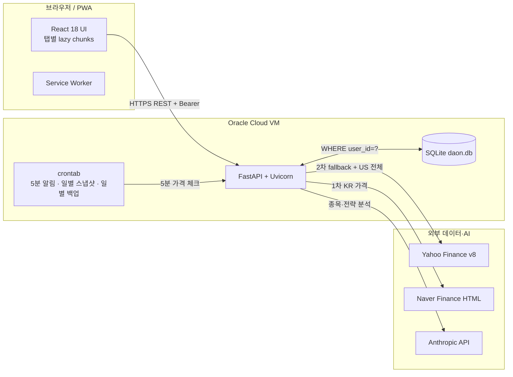

# 다온 (Daon) — Personal Stock Portfolio

> React + FastAPI 기반 **미국·한국 주식 통합 포트폴리오 관리 + Claude AI 분석** 앱.
> Oracle Cloud Free Tier VM에서 24/7 운영 중인 개인 투자자용 도구.

[](https://github.com/Jayden-KR83/Daon-Stock/actions/workflows/ci.yml)


---

## 핵심 기능

| 영역 | 기능 |
|---|---|
| **포트폴리오** | 미국·한국 주식 통합 평가액 (USD↔KRW 자동 환산) · 동적 계좌 (사용자별 자유 추가) · 사용자별 격리 (PBKDF2 + 30일 토큰) |
| **분석** | 비중 도넛 (계좌·섹터·종목별) · 성과 분석 (수익률·MDD·샤프) · Net Worth 일별 자동 스냅샷 · Portfolio Health Score (S/A/B/C/D) |
| **AI** | Claude Sonnet 4.6 + `web_search` 종목 심층 분석 (24h 캐시) · Haiku 4.5 포트폴리오 전략 리포트 · 사용자별 권한 토글 (비용 게이트) |
| **알림** | 룰 기반 리밸런싱 경고 (단일 종목·섹터 집중·큰 손실·중복 노출·미분산) · 목표가/손절가 알림 (5분 cron) · 미확인 카운트 벨 |
| **시장** | 12개 지수 마켓바 (S&P·Dow·Nasdaq·VIX·Russell·KOSPI·BTC·ETH·Gold·USD·10Y) · 섹터 히트맵 (Treemap + 드릴다운) |
| **종목** | SVG 캔들차트 1M~5Y · MA20/60/120 · RSI · 거래량 · EPS Estimate/Actual · Revenue vs Earnings · FIFO 거래내역 |
| **배당** | yfinance dividends 기반 24개월 이력 + 연간 예상 + 다가오는 ex-date |
| **UX** | PWA 설치 + 오프라인 · 다크/프로/라이트 3-모드 테마 · 단축키 (1-5 / / ? ESC) · 모바일 반응형 |

---

## 기술 스택

- **Frontend**: React 18 + Vite + Zustand + React Query + Recharts + Motion 12
- **Backend**: FastAPI (Python 3.10) + SQLite + Uvicorn + systemd
- **AI**: Anthropic Claude Sonnet 4.6 + `web_search_20250305` (max_uses=4) · Haiku 4.5
- **Data**: Yahoo Finance v8 API · Naver Finance 스크래핑 (+ yfinance `.KS/.KQ` fallback + 30분 stale-while-revalidate)
- **Infra**: Oracle Cloud Free Tier ARM VM (1GB RAM + 1GB swap, systemd memory limits)
- **PWA**: vite-plugin-pwa (autoUpdate + skipWaiting + workbox runtime cache)
- **번들**: manualChunks (vendor-react/motion/recharts/xlsx) + 탭별 React.lazy → 초기 192 KB gzip
- **테스트**: pytest 25건 + Puppeteer 회귀 + GitHub Actions CI

---

## 시스템 아키텍처



상세는 [docs/architecture.md](docs/architecture.md) 참조 (시스템·인증·KR 가격 fallback 3종 Mermaid 다이어그램).

---

## 빠른 시작 (로컬 개발)

```bash
# 1. 백엔드 (FastAPI)
cd backend
pip install -r requirements.txt
uvicorn main:app --host 0.0.0.0 --port 8000 --reload

# 2. 프론트엔드 (Vite dev server, port 3000 → /api 프록시 → :8000)
cd ../frontend
npm install
npm run dev

# 3. 테스트
cd ../backend
pip install -r requirements-dev.txt
pytest
```

### 환경 변수
없음 — Anthropic API Key는 앱 내 `/관리 → API Key` UI를 통해 SQLite `settings` 테이블에 저장.

### 첫 사용자
`POST /api/auth/signup` 으로 가입 후 admin 승인 (`status = approved`) 받아야 사용 가능. 첫 가입자를 admin으로 만들려면:
```bash
sqlite3 daon.db "UPDATE users SET status='approved', is_admin=1, ai_enabled=1 WHERE email='your@email.com';"
```

---

## 문서

| 문서 | 내용 |
|---|---|
| [CLAUDE.md](CLAUDE.md) | 인덱스 — 새 작업 진입 시 가장 먼저 |
| [docs/architecture.md](docs/architecture.md) | 시스템 구조 · DB 스키마 · Mermaid 다이어그램 |
| [docs/api.md](docs/api.md) | 60+ endpoint · 캐시 TTL · AI 모델 · 인증 의존성 |
| [docs/deployment.md](docs/deployment.md) | 배포 절차 · systemd · cron · 검증 체크리스트 |
| [docs/troubleshooting.md](docs/troubleshooting.md) | UI 9 체크리스트 · React TDZ 함정 · 흔한 버그 패턴 |
| [design.md](design.md) | Material 3 + 핀테크 디자인 시스템 (Robinhood/Toss/Cash App 분석) |
| [DEVELOPMENT_LOG.md](DEVELOPMENT_LOG.md) | 시간순 변경 이력 |

---

## 테스트

```bash
$ pytest -v
============================== 25 passed in 2.70s ==============================
```

| 파일 | 검증 |
|---|---|
| `tests/test_kr_ticker.py` | 한국 종목 정규식 `^A?\d{6}$` (A-prefix POSCO 인시던트 회귀) |
| `tests/test_fifo.py` | FIFO 매칭 실현손익 + 부분 매도 + 수수료/세금 |
| `tests/test_alerts_rules.py` | 룰 5종 (집중·손실·섹터·중복·미분산) + severity 정렬 |
| `tests/test_currency.py` | KR/US 환율 환산 + A-prefix가 KR로 인식되는지 회귀 |

GitHub Actions가 push/PR마다 자동 실행.

---

## 개발 철학

이 프로젝트는 **AI 페어 프로그래밍 (Claude Code)** 으로 개발됨. 핵심 원칙:

- **AI 티 박스 디자인 절대 금지** — 둥근 모서리 + 그라데이션 + 색상 음영 배지는 `design.md`에서 차단. 직사각형 + 글자색 강조만.
- **빌드 OK ≠ 완료** — 9 체크리스트 정적 검증 통과 후에만 보고 (UI/포털/z-index/배경/모바일/테마/접근성).
- **할루시네이션 필터로서의 TDD** — 핵심 로직은 pytest로 회귀 보호. AI가 망가뜨려도 즉시 발견.
- **CLAUDE.md는 인덱스** — 단일 거대 문서 X. 도메인별 분할 → 새 세션이 필요한 .md만 참조 (토큰 절감).

자세한 협업 패턴은 `CLAUDE.md` + `memory/` (개인 시스템).

---

## 라이선스

Personal / Private use. 본인 포트폴리오 관리 용도로 fork·수정 자유. 상업적 배포·재판매는 별도 협의 필요.

---

## 크레딧

- Built with [Claude Code](https://claude.com/claude-code) — Anthropic
- 디자인 영감: Robinhood · Toss · Cash App · Yahoo Finance
- 데이터: Yahoo Finance · Naver Finance
- AI: Anthropic Claude Sonnet 4.6 + Haiku 4.5
- 인프라: Oracle Cloud Free Tier
