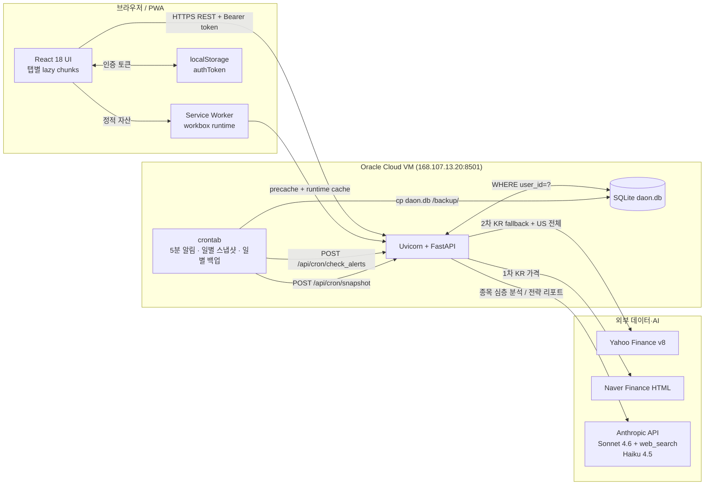
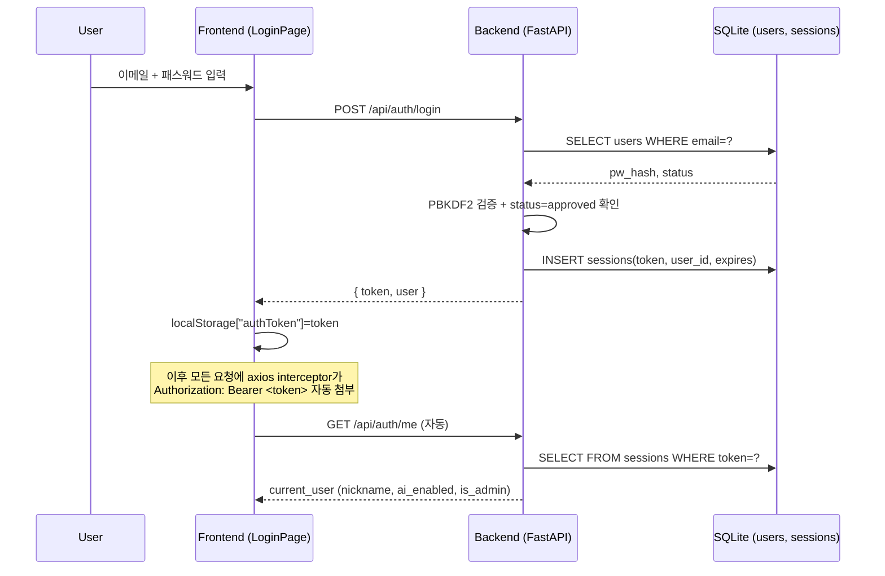
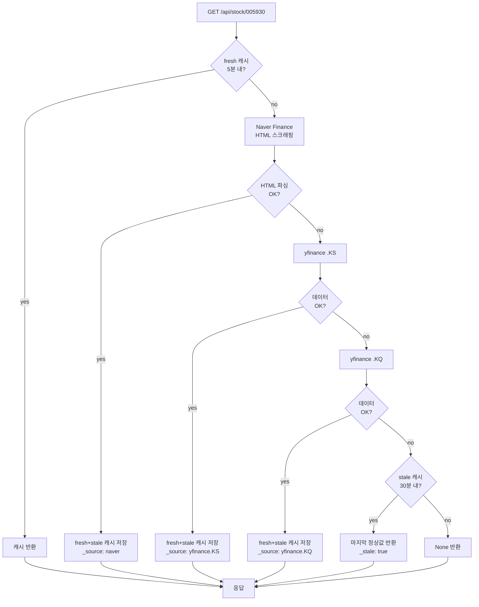

# 다온 — 시스템 아키텍처

> 새 세션 진입 시 코드 구조를 5분 안에 이해하기 위한 단일 진입점.
> 변경 시 Mermaid 다이어그램을 함께 업데이트.

## 1. 기술 스택 한눈에

| 계층 | 기술 | 비고 |
|---|---|---|
| Frontend | React 18 + Vite + Zustand + React Query + Recharts | Manrope · Motion 12 · 21st.dev |
| Backend  | FastAPI (Python 3.10) + SQLite (`daon.db`) | systemd 서비스 |
| AI       | Claude Sonnet 4.6 + `web_search_20250305` (max_uses=4) / Haiku 4.5 | 24h 캐시 |
| Data     | yfinance v8, Naver Finance 스크래핑 + KIS Open API 미적용 | KR은 `.KS/.KQ` fallback + stale 30분 |
| Logos    | parqet (US) · Toss CDN 1차 + Alphasquare 2차 (KR) | |
| Infra    | Oracle Cloud Free Tier ARM VM · 1GB RAM + 1GB swap | OOM 보호 systemd memory limits |
| PWA      | vite-plugin-pwa (autoUpdate + skipWaiting + clientsClaim) | precache + workbox runtime cache |
| 번들     | manualChunks (vendor-react/motion/recharts/xlsx/query/zustand) + 탭별 React.lazy | 초기 192KB gzip |

## 2. 시스템 컴포넌트 다이어그램



## 3. 사용자 인증 흐름



## 4. 가격 조회 흐름 (KR 종목 이중화)



## 5. 폴더 구조 (현재)

```
쿠든카피 주식앱/
├── CLAUDE.md                  ← 인덱스 (다른 docs/* 가리킴)
├── design.md                  ← Material 3 + 다온 디자인 시스템
├── DEVELOPMENT_LOG.md         ← 시간순 변경 이력
├── docs/                      ← (NEW) 도메인별 분할 문서
│   ├── architecture.md        ← 이 파일
│   ├── api.md                 ← endpoint·캐시·AI 정책
│   ├── deployment.md          ← scp / systemd / cron / 도메인
│   └── troubleshooting.md     ← 검증 체크리스트 + 흔한 함정
├── backend/
│   ├── main.py                ← FastAPI 전체 (60+ endpoint)
│   ├── tests/                 ← (NEW) pytest 회귀
│   └── static/                ← Vite 빌드 산출물
├── frontend/
│   ├── vite.config.js         ← manualChunks + PWA
│   └── src/
│       ├── App.jsx            ← lazy + Suspense
│       ├── store.js           ← Zustand
│       ├── api.js             ← Axios helper
│       ├── tokens.css         ← M3 color tokens
│       ├── App.css            ← 전역 + mono-card system
│       ├── components/        ← 30+ 재사용 컴포넌트
│       └── tabs/              ← 10개 탭 (lazy로 9개)
├── scripts/
│   ├── deploy.ps1
│   ├── regression-test.js     ← Puppeteer
│   └── daon-daily-snapshot.sh ← cron 호출
├── daon.db                    ← 운영 SQLite (절대 수정 금지)
└── .github/workflows/         ← (NEW) GitHub Actions CI
```

## 6. 데이터베이스 스키마

| 테이블 | PK | 주요 컬럼 | 용도 |
|---|---|---|---|
| users | user_id | email, name, pw_hash, status, ai_enabled, is_admin | 멀티 유저 |
| sessions | token | user_id, expires | 30일 토큰 |
| portfolios | (user_id, account, ticker) | name, avg_price, quantity, sector | 보유 |
| watchlist | (user_id, ticker) | name, exchange, qtype | 관심 |
| accounts | (user_id, key) | label, currency, sort_order | 동적 계좌 |
| settings | key | value | API key, cron_secret |
| transactions | id | side, quantity, price, traded_at | FIFO 실현손익 |
| holding_notes | (user_id, ticker) | note, stop_loss, target | 종목 메모 |
| net_worth_snapshots | (user_id, snapshot_date) | total_krw, breakdown | 자산 추이 |
| holding_pnl_snapshots | (user_id, snapshot_date, ticker) | value_krw, pnl_krw | 종목별 P/L |
| metrics_cache / strategy_cache | (user_id, scope) | result_json, computed_at | AI 결과 캐시 |
| audit_log | id | event_type, details (json) | 활동 로그 |
| price_alerts | id | ticker, target_high/low, enabled, triggered_at | 목표가 알림 |
| notifications | id | kind, target_price, current_price, read_at | 미확인 알림 |
| discovery_scores | ticker | market, peg, eps_growth, roe, pct_*, composite_score, gate_pass, data_completeness | 신규 발굴 GARP 일배치 (공용) |

### DB 접근 패턴 (모든 endpoint 공통)
```python
with _db() as conn:  # contextmanager → exit 시 자동 commit
    rows = conn.execute("SELECT ... WHERE user_id=?", (cu['user_id'],)).fetchall()
    conn.execute("INSERT OR REPLACE INTO ...", (...))
```

## 7. 디자인 시스템

`design.md` 참조 — Material 3 + 핀테크 트렌드 (Robinhood/Toss/Cash App). 핵심:
- 직사각형 (`border-radius: 2~4px`), 그라데이션 금지
- 색상은 의미가 있는 숫자만 (pos/neg). 텍스트는 무채색
- `--m-surface / --m-outline-variant / --m-text / --m-text-secondary / --m-text-tertiary` 토큰만 사용
- 좌측 머리글: `.mono-section-title` 의 ::before 2px 색띠 (text / accent / positive / negative)

## 8. 절대 수정 금지 파일
- `daon.db` — 운영 DB. 백업 후 스키마 변경.
- `portfolio_data.json`, `users.json` — 마이그레이션 완료된 구버전.
